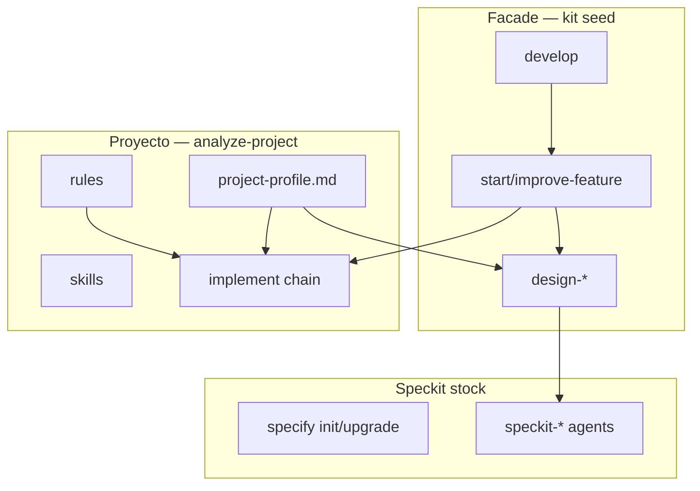

# Philosophy — Tres zonas del harness

Este documento describe la filosofía del **Cursor Speckit Harness**. No se copia al proyecto destino; vive en `reference/` del kit.

## Problema que resuelve

Speckit provee Spec-Driven Development (SDD) genérico. Cada proyecto necesita:

1. Política propia (stack, arquitectura, convenciones)
2. Un pipeline estable de diseño → implementación
3. Artefactos Cursor (rules, skills, agents) alineados al código real

El kit separa lo **regenerable** (Speckit stock) de lo **estable** (facade) y lo **específico** (generado por análisis).

## Tres zonas

### Zona 1 — Speckit stock

- **Qué:** CLI, `.specify/`, agents/commands Speckit del integrador
- **Owner:** `specify init` / `specify upgrade`
- **Regla:** nunca añadir lógica del proyecto aquí

### Zona 2 — Facade (seed del kit)

- **Qué:** `develop`, `design-*`, `start-feature`, `improve-feature`, `orchestrate`, `design-adapters.mdc`
- **Owner:** kit `cursor-speckit-harness` — copiado una vez, topología fija
- **Regla:** `/analyze-project` solo hace fill-in de slots, no reinventa el pipeline

### Zona 3 — Proyecto (generado)

- **Qué:** rules con globs, skills, agents de implementación, `project-profile.md`, overlays opcionales
- **Owner:** `/analyze-project` + git del repo
- **Regla:** todo valor en `project-profile.md` debe tener evidencia en el repo

## Contrato facade

Los `@design-*` son la **única** capa entre orquestadores y Speckit:

| Orquestador | Adapters | Motor |
|-------------|----------|-------|
| `start-feature` / `improve-feature` | `design-*` | `speckit-*` |
| Fase 6 | — | `@implement` (proyecto) |

**Prohibido en flujo diario:** invocar `speckit-implement` o `/speckit.*` directamente.

## Por qué no editar Speckit stock

`specify upgrade` regenera archivos stock. Si mezclás política del proyecto ahí:

- Se pierde en el próximo upgrade
- Se contamina el motor SDD portable
- Se rompe la verificación de `/orchestrate`

La política va en: facade adapters, overlays (`.cursor/templates/speckit/`), rules y `project-profile.md`.

## Relación con OpenCode

Este kit es el equivalente Cursor del harness OpenCode usado en proyectos como gestDoc:

- `.opencode/instructions/` → `.cursor/rules/`
- `.opencode/agents/` → `.cursor/agents/`
- `.opencode/commands/` → `.cursor/commands/`
- `.opencode/skills/` → `.cursor/skills/`

Ver `mapping-from-opencode.md` para tabla detallada.

## Comandos hermanos

| Comando | Alcance |
|---------|---------|
| `/analyze-project` | Artefactos IDE en `.cursor/` |
| `/audit-improvements` | Calidad del **código fuente** |
| `/orchestrate` | Verificación Speckit ↔ facade |

No confundir analyze (IDE) con audit (código).

## Ciclo de vida

1. `specify init` — instala motor SDD
2. Copiar `seed/` — instala facade
3. `/analyze-project` — genera capa proyecto
4. `/orchestrate` — verifica vínculos
5. `@develop` — uso diario
6. `specify upgrade` → `/orchestrate` → `/analyze-project --update` si hay deriva
