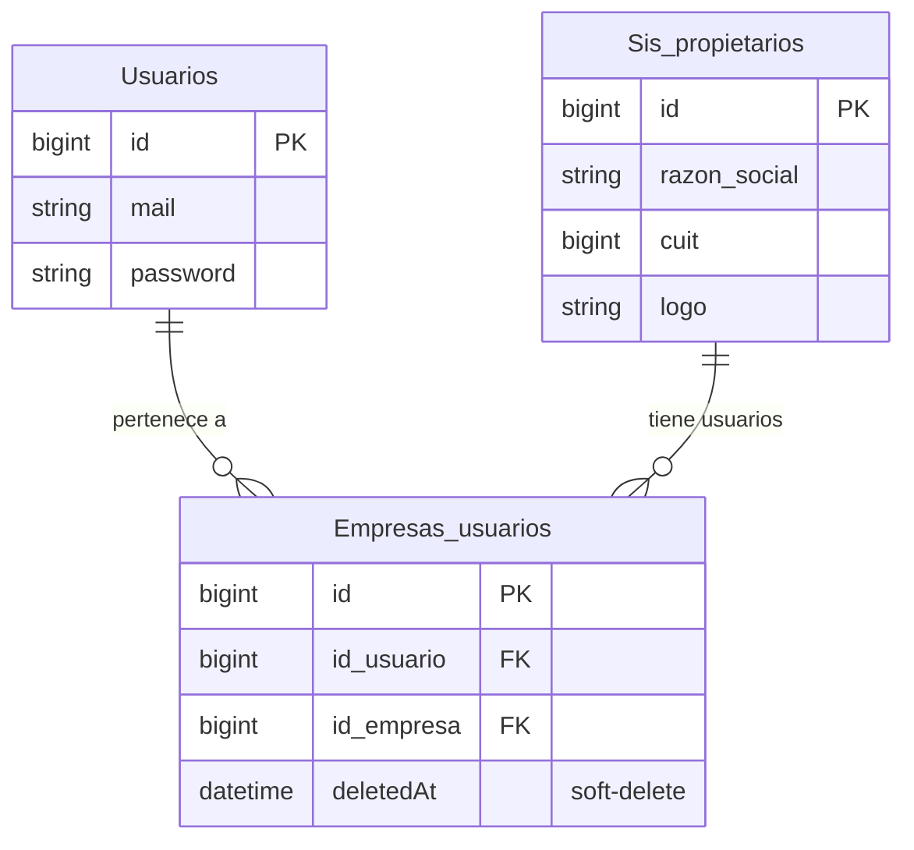

# Data Model — Empresas_usuarios

## Entidades involucradas

### 1. `EmpresaUsuario` (tabla `Empresas_usuarios`)

Relación N:N entre usuarios y empresas. Es la entidad central del nuevo dominio.

| Campo        | Tipo SQL              | Tipo TS                    | Notas                          |
| ------------ | --------------------- | -------------------------- | ------------------------------ |
| `id`         | `BIGINT PK AI`        | `CreationOptional<number>` | Auto-generado                  |
| `id_empresa` | `BIGINT FK`           | `number`                   | → `Sis_propietarios.id`        |
| `id_usuario` | `BIGINT FK`           | `number`                   | → `Usuarios.id`                |
| `createdAt`  | `DATETIME`            | `CreationOptional<Date>`   | Gestionado por Sequelize       |
| `updatedAt`  | `DATETIME`            | `CreationOptional<Date>`   | Gestionado por Sequelize       |
| `deletedAt`  | `DATETIME (nullable)` | `CreationOptional<Date>`   | Soft-delete — `paranoid: true` |

**Soft-delete:** registros con `deletedAt != null` se excluyen automáticamente con `paranoid: true`.

---

### 2. `SisPropietario` (tabla `Sis_propietarios`) — solo lectura, vía asociación

Campos que el dominio `Empresas_usuarios` expone a través de la asociación `belongsTo`:

| Campo          | Tipo SQL       | Tipo TS          | Notas                                |
| -------------- | -------------- | ---------------- | ------------------------------------ |
| `id`           | `BIGINT PK`    | `number`         | Clave primaria                       |
| `razon_social` | `VARCHAR`      | `string`         | Nombre legal de la empresa           |
| `cuit`         | `BIGINT`       | `number`         | Identificador fiscal                 |
| `logo`         | `VARCHAR NULL` | `string \| null` | URL completa (sin prefijo adicional) |

> El modelo completo de `Sis_propietarios` ya está implementado en
> `packages/server/src/domains/Ownersyss/Infrastructure/Database/Ownersys.model.ts`.
> El nuevo dominio lo **reutiliza mediante asociación Sequelize** y no duplica el modelo.

---

## Modelo Sequelize — `EmpresasUsuariosModel`

```typescript
// packages/server/src/domains/Empresas_usuarios/Infrastructure/Database/EmpresasUsuarios.model.ts

import { sequelize } from '@server/Infrastructure';
import {
  CreationOptional,
  DataTypes,
  InferAttributes,
  InferCreationAttributes,
  Model,
} from 'sequelize';
import { OwnersysModel } from '@server/domains/Ownersyss/Infrastructure/Database/Ownersys.model';

export class EmpresasUsuariosModel extends Model<
  InferAttributes<EmpresasUsuariosModel>,
  InferCreationAttributes<EmpresasUsuariosModel>
> {
  declare id: CreationOptional<number>;
  declare id_empresa: number;
  declare id_usuario: number;
  declare createdAt: CreationOptional<Date>;
  declare updatedAt: CreationOptional<Date>;
  declare deletedAt: CreationOptional<Date>;

  // asociación eager-loaded
  declare Empresa?: OwnersysModel;
}

EmpresasUsuariosModel.init(
  {
    id: {
      type: DataTypes.BIGINT,
      primaryKey: true,
      autoIncrement: true,
      allowNull: false,
    },
    id_empresa: {
      type: DataTypes.BIGINT,
      allowNull: false,
    },
    id_usuario: {
      type: DataTypes.BIGINT,
      allowNull: false,
    },
    createdAt: DataTypes.DATE,
    updatedAt: DataTypes.DATE,
    deletedAt: DataTypes.DATE,
  },
  {
    sequelize,
    paranoid: true,
    modelName: 'EmpresasUsuariosModel',
    tableName: 'Empresas_usuarios',
  },
);
```

---

## Asociación Sequelize

```typescript
// Definir dentro del archivo del modelo o en un init-associations call:

EmpresasUsuariosModel.belongsTo(OwnersysModel, {
  foreignKey: 'id_empresa',
  as: 'Empresa',
});

// Opcionalmente, para navegación inversa (no requerido por esta feature):
OwnersysModel.hasMany(EmpresasUsuariosModel, {
  foreignKey: 'id_empresa',
  as: 'EmpresasUsuarios',
});
```

**Nota:** la asociación debe inicializarse **después** de que ambos modelos estén cargados. El lugar correcto es el archivo de implementación del repositorio o un archivo `associations.ts` llamado desde el bootstrap del servidor.

---

## Diagrama de relaciones



---

## Entidad de dominio — `EmpresaUsuario`

```typescript
// packages/server/src/domains/Empresas_usuarios/Domain/EmpresasUsuarios.entity.ts

export interface IEmpresaUsuario {
  id: number;
  razon_social: string;
  cuit: number;
  logo: string | null;
}

export class EmpresaUsuario {
  constructor(
    private readonly _id: number,
    private readonly _razon_social: string,
    private readonly _cuit: number,
    private readonly _logo: string | null,
  ) {}

  static create({
    id,
    razon_social,
    cuit,
    logo,
  }: IEmpresaUsuario): EmpresaUsuario {
    return new EmpresaUsuario(id, razon_social, cuit, logo);
  }

  get values(): IEmpresaUsuario {
    return {
      id: this._id,
      razon_social: this._razon_social,
      cuit: this._cuit,
      logo: this._logo,
    };
  }

  toJSON() {
    return this.values;
  }
}
```
